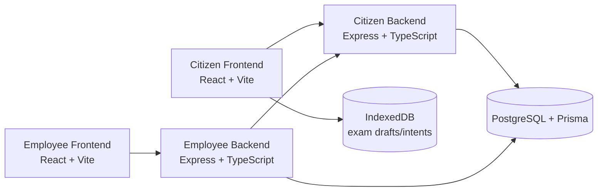
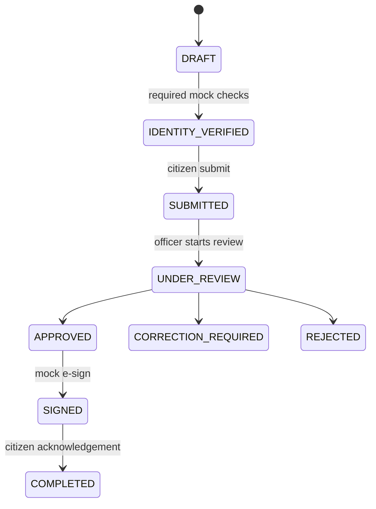
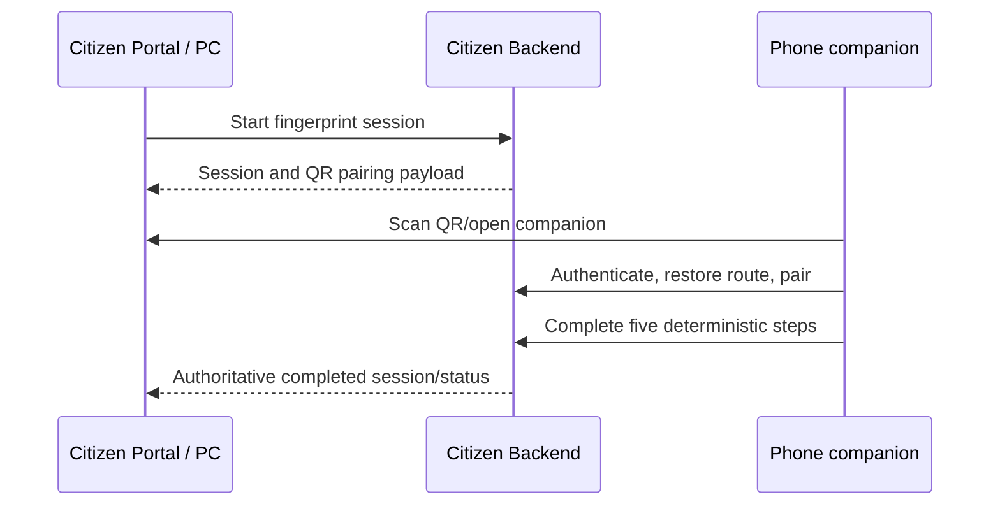

# JANSEVA-X Technical Documentation

## 1. Project overview and scope

JANSEVA-X is a consent-based government-application intelligence layer. It addresses the prototype application experience: discover a supported service, prepare it only with consent, verify required demo information, submit it, and retain an officer-owned decision boundary.

Citizen capability includes authentication; catalog/JANSEVA AI discovery; voice/text intent; automatic application opening; Smart Fill/Smart Attach; document validation/analysis; mock Aadhaar, PAN, face, e-KYC, and fingerprint checks; draft/submit; submission tickets; tracking; generated documents; mock e-sign; completion; and SSC CGL demo/offline support.

Employee capability includes login, dashboard, queue, claim/release, document review, AI pre-verification, identity summary, officer review, approve/correction/reject decisions, and prototype document issuance. The citizen completes the mock e-sign and completion steps.

All people, records, documents, decisions, providers, payments, and signatures are synthetic demo artifacts.

## 2. Architecture



Supporting components are JANSEVA AI/copilot, Smart Fill/Attach, the synthetic issued-document registry, mock identity providers, fingerprint sessions, the submission worker, generated-document/mock-signing services, and production-only Citizen PWA service-worker registration.

| Directory | Responsibility |
| --- | --- |
| `citizen-backend` | Citizen API, Prisma schema/migrations/seed, mock providers, fingerprint sessions, tickets, documents, and signing. |
| `citizen-frontend` | Citizen Portal, copilot, scanner companion, exam/offline UI, and PWA assets. |
| `employee-backend` | Employee API, authorization, review decisions, and document-issuance bridge. |
| `employee-frontend` | Employee dashboard and review UI. |
| `shared` | Shared API contract documentation. |
| `docs` | Engineering reference and live-demo guide. |

## 3. Authentication and authorization

- Citizen authentication issues JWT access/refresh tokens; protected routes require authentication and active accounts.
- Citizen routes require `CITIZEN` and scope records to the authenticated citizen.
- Employee routes require active `OFFICER`/`ADMIN`; claim is officer-only and assignment is admin-only.
- Document, generated-document download, and signing access are authorized and ownership-scoped.
- Validation, controlled errors, explicit CORS origins, Helmet, rate limiting, path-safe storage, and lifecycle checks are implemented. No public debug trace is intended.

## 4. Application lifecycle

`ApplicationStatus`, officer review state, and submission-ticket processing state are separate.



The schema also defines `DOCUMENTS_VERIFIED`; it is not a direct core transition in the current guards. Review state is `NOT_ASSIGNED`, `ASSIGNED`, `IN_REVIEW`, or `REVIEWED`. Submission tickets are `PENDING`, `PROCESSING`, `COMPLETED`, or `FAILED`; ticket completion does not replace the Employee review lifecycle.

## 5. JANSEVA AI and document preparation

JANSEVA AI is a Citizen Frontend copilot. It loads supported services/exams, accepts typed input and browser speech recognition where available, and deterministically matches supported prototype requests. It asks for clarification where a match is unavailable.

After a citizen confirms preparation, it opens/creates the supported application, requests consent, fills only empty fields from consented available demo data, links matching issued demo documents, hands off to verification, and then asks the citizen to choose submit or save draft. Voice listening state is cleaned up with the UI lifecycle; typed input remains available.

Document pipeline:

```text
upload or issued-demo link → validation/metadata/bounded analysis → employee review
→ officer decision → prototype generated document → citizen mock e-sign → completion
```

Mock issued documents are registry fixtures linked to an application; they are distinct from citizen uploads. Analysis is prototype assistance, not authenticity or government verification.

## 6. Identity verification and fingerprint flow

Mock Aadhaar, PAN, e-KYC, face, and fingerprint providers are deterministic prototype providers. No live UIDAI/PAN/e-KYC service is contacted. Face is not biometric matching.



The fingerprint session has expiry, ownership, pairing-challenge, and step-order checks. Login preserves a restricted companion return context, so authentication returns the phone to the same session. The sequence is right index, middle, ring, pinky, and thumb. Scanner hashes/fragments are synthetic display data only.

**No fingerprint image, template, minutiae, real biometric sample, or biometric match is captured, stored, transmitted, or used.**

## 7. Submission, Employee review, and signing

Citizen submission from `IDENTITY_VERIFIED` transactionally creates a durable ticket and transitions the application to `SUBMITTED`. Client idempotency keys and existing-ticket checks produce stable results; the worker processes tickets independently and failed tickets can be retried through the supported citizen route.

Employees claim/release cases, review documents and identity summaries, start review, and make the only final decision. Valid employee decisions are `UNDER_REVIEW` to `APPROVED`, `CORRECTION_REQUIRED`, or `REJECTED`.

An approved application may receive a prototype generated document through the authorized issuance bridge. The citizen starts an expiring mock signing session, accepts mock consent, completes it, then acknowledges completion. **AI is advisory; final decisions remain officer-owned.**

## 8. Exam and offline architecture

SSC CGL is a fictional demo exam. Server records include application data, requirements, mock-document links, timeline/reminder data, and submission attempts. The Citizen frontend stores per-user drafts and offline submission intents in IndexedDB. It synchronizes queued intent on reconnect.

Web Crypto creates a browser payload hash when available; server receipt time and the deadline snapshot remain authoritative. Exam attempts use `RECEIVED`, `ACCEPTED`, or `REJECTED_PERMANENT`, separate from browser queue state. The Citizen service worker is registered only in production builds and does not turn local data into a government submission.

## 9. Database, APIs, and testing

PostgreSQL and Prisma hold users/profiles/officers, services/applications/status history/tickets, documents/issued-document links, verifications/fingerprint sessions, generated documents/signing consents, and exam records. Reviewed migrations and synthetic seeds live in `citizen-backend/prisma`.

Important API groups are Citizen `/health`, `/auth`, `/citizen`, `/services`, `/applications`, `/documents`, `/exams`, `/exam-applications`, fingerprint-session, and generated-document/signing routes; and Employee `/health`, `/employee`, `/employee/applications`, and `/employee/documents` routes. See [Citizen API documentation](../citizen-backend/API_DOCUMENTATION.md) and [shared contract](../shared/API_CONTRACT.md) for endpoint contracts.

| Package | Automated checks |
| --- | --- |
| `citizen-backend` | `npm run test:types`, `npm test`, `npm run build` |
| `employee-backend` | `npm run test:types`, `npm test`, `npm run build` |
| `citizen-frontend` | `npx --no-install tsc -p tsconfig.app.json --noEmit`, `npm run build` |
| `employee-frontend` | `npm run typecheck`, `npm run build` |

Manual/browser verification covers the Citizen journey, QR pairing, Employee decision branches, generated document/mock signing, and exam offline/reconnect behavior.

## 10. Boundaries, limitations, and future work

JANSEVA-X is synthetic/demo only: Mock Aadhaar, PAN, Address, Birth Certificate, 10th Marksheet, face, fingerprint, e-KYC, generated documents, and e-sign have no legal or government validity. There is no real government integration, biometric provider, registry, payment, e-KYC, or e-sign provider. The fingerprint demo is local-LAN dependent; IndexedDB data does not replace server confirmation.

**Future productionization, not current functionality:** approved provider integrations, managed infrastructure/secrets/observability, backup and audit operations, accessibility and privacy assessment, threat modeling, and formal security/compliance work.
